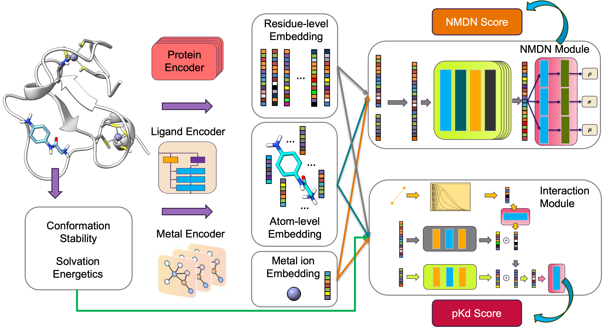

# Normalized Mixture Density Network (NMDN)

It is the official implementation of the NMDN model published at [REPLACE_ME]().



# Environment Setup

- [torch](https://pytorch.org/)                     1.13.1
- [torch-geometric](https://pytorch-geometric.readthedocs.io/en/latest/install/installation.html)           2.2.0; The following dependencies should also be installed along with torch-geometric.
    - torch-scatter             2.1.0
    - torch-sparse              0.6.15
    - torch-cluster             1.6.0
- [fair-esm](https://github.com/facebookresearch/esm)                2.0.0
- [rdkit](https://www.rdkit.org/docs/Install.html)                     2023.9.3
- [prody](http://www.bahargroup.org/prody/)                     2.4.1
- [seaborn](https://seaborn.pydata.org/)                   0.13.2

# Run NMDN model
To run prediction, you need the protein structure `PROTEIN.pdb` and docked ligand poses `LIG1.sdf`, `LIG2.sdf`, ...

```bash
python predict.py --prot PROTEIN.pdb --ligs LIG1.sdf LIG2.sdf ...
```

You will get prediction of the NMDN score and pKd score for each protein-ligand pairs. If you only want to predict the NMDN score, you can add the `--nmdn_only` argument.

```bash
python predict.py --nmdn_only --prot PROTEIN.pdb --ligs LIG1.sdf LIG2.sdf ...
```
